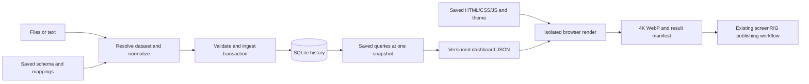

# Persistent dashboard images in the screenRIG plugin

Status: technical design with an initial local implementation, 2026-09-16.
The end-to-end authoring path is source-ready; it is not published. Current
commands and limits live in `skills/screenrig-dashboard/references/`.

The initial implementation covers immutable schemas, append-only corrections,
SQLite history, saved query/presentation revisions, missing series buckets, and
offline 4K WebP rendering. The broader design below also specifies work that is
not implemented yet: schema migrations, backup/restore commands, a full metric
expression language, draft-to-active presentation promotion, and cross-platform
release qualification. Current queries use bounded registered plans over SQLite
records, not the complete SQL compiler proposed below. Do not treat every design
section as a claim about available commands.

## 1. Outcome and scope

Add a second skill, `screenrig-dashboard`, to the existing official plugin. It
turns recurring structured or messy input into a persistent dataset, a stable
dashboard, and a 3840 × 2160 WebP. Subsequent runs update observations and render
the same dashboard design. The existing `screenrig` skill publishes that image
through the normal media and playlist workflow when publication was requested.

The first release must complete the whole local path: discover an existing
dataset, normalize input, validate and ingest records, query current and
historical data, create or reuse HTML/CSS/JS, and capture the finished image.
It must work without a screenRIG account until the publication step.

The host agent interprets messy input. The runtime does not call a model API,
require a separate model key, or assume a particular agent vendor.

Included:

- JSON, NDJSON, CSV, TSV, and agent-normalized text input.
- Multiple datasets and dashboards in one local workspace.
- Stable dataset identity, typed records, immutable definitions, deduplication,
  explicit corrections, historical imports, and data provenance.
- Current values, line/bar time series, category bars, bounded gauges, and tables.
- A saved 16:9 HTML/CSS/JS presentation, dark-modern default theme, and 4K WebP.
- Deterministic payloads, reproducible local renders, and recoverable failures.
- Packaging, regression tests, and documentation within this repository.

Deferred: hosted storage, other database adapters, source connectors, a scheduler,
live interactive dashboard hosting, cross-machine synchronization, arbitrary SQL
authoring, user-supplied executable templates, multi-page dashboards, portrait
layouts, and predictive or inferred historical data. Existing connectors can
provide files; existing scheduling facilities can invoke the skill if separately
requested. No new service is required.

## 2. Repository findings that constrain the design

The inspected checkout was clean at `b60a23ca4601fb9ea98f894948d029a4323c82a6`.
These are source observations, not installation or live-service verification:

| Current source | Consequence |
| --- | --- |
| `skills/screenrig/` is canonical; `plugins/screenrig/` is generated. | Add the new skill to canonical inputs and extend the generator. Never patch the distributed copy independently. |
| `scripts/build-plugin.py` has a single `SKILL` constant; copying and comparison name only `screenrig`. | Generalize discovery, copying, and stale-file removal for the complete canonical skills directory. |
| The generated Codex manifest already points to `./skills/`. | Keep one plugin and its current marketplace identities. Verify multi-skill discovery in each supported host. |
| `scripts/validate-plugin.py` and command tests primarily inspect `skills/screenrig/`. | Discover and validate both skills, while keeping separate command inventories for the two executables. |
| The main launcher requires Node.js 20.11+ and only preflights Node. | Dashboard prerequisites must never enter the main launcher. |
| The CLI already has `screenrig dashboard`, which opens the account dashboard. | Do not repurpose that command. The local helper is `screenrig-dashboard`. |
| Bundle limits are 340 MiB unpacked, 145 MiB compressed, and 2 MiB per file outside the existing native dependency exception. | Do not bundle Chromium, virtual environments, or SQLite native wheels. Preserve the existing limits. |
| `components.lock.json` records the packed CLI artifact. | Keep dashboard dependency provenance separate from CLI provenance. |
| Image upload accepts delivery WebP with `--no-transcode`, rejects lossless VP8L, and normally bounds each edge to 3840 when transcoding. | Produce a 3840 × 2160 lossy WebP and use the existing unchanged-byte upload path; verify the stored object separately. |

Current CLI artifact provenance: repository `screenrig/cli`, commit
`4a3ca1a5de3a060d576fb5e54cafa164992dd12f`, artifact `screenrig-cli.tgz`, SHA-256
`bbdb003b66c5143c5d9d5449a57eff1a1c6737b46bb79629af7495b904c8239a`.
Implementation must recheck this provenance before regenerating the bundle.

## 3. Ownership and invocation

| Component | Owns |
| --- | --- |
| Host LLM with `screenrig-dashboard` | Identifying the dataset, interpreting messy inputs, proposing initial definitions, choosing meaningful metrics, and inspecting the first image. |
| Dashboard helper | Parsing, validation, persistent definitions, SQLite transactions, queries, payloads, presentation compilation, rendering, and result manifests. |
| `screenrig` skill and bundled CLI | Authentication, media upload, playlist updates, screen assignment, and playback verification. |

The main skill gains one content-path row and a short cross-reference. Its normal
bootstrap does not read the dashboard references or initialize the dashboard
runtime. Skill descriptions remain independently discoverable. Official skill
documentation supports related skills in one plugin and loading detailed
instructions only when a skill is selected. [Plugin skills](https://developers.openai.com/plugins/build/skills), [skill discovery](https://learn.chatgpt.com/docs/build-skills).
These discovery rules keep the detailed dashboard procedure out of ordinary
screenRIG operating context; they do not eliminate its short discovery entry.

Suggested new description:

> Build and refresh consistent 16:9 dashboard images from recurring JSON, CSV,
> or messy data. Preserve schemas, history, queries, and dashboard design between
> runs. Use screenrig to publish the resulting image when requested.

The new skill should distinguish this workflow from opening the account
dashboard and from publishing an already existing dashboard URL.

Local operation needs no account bootstrap. Publication follows the existing
skill and its installed launcher. A combined user request authorizes the agent
to perform both stages; there is no additional routine confirmation between them.

## 4. Architecture and lifecycle



First run:

1. Resolve the workspace and search its dataset registry.
2. If no suitable dataset exists, record its grain, field meanings, units, keys,
   time semantics, and mappings. Validate and register the definition.
3. Normalize and ingest the supplied observations, retaining source provenance.
4. Define dashboard queries and bindings from the available data and user goal.
5. Compile a proposed presentation, render actual data, and visually inspect it.
   Adjust that draft until it fits and communicates accurately.
6. Activate the successful dashboard revision and return its WebP and manifest.
7. If requested, publish using the existing screenRIG workflow.

Subsequent run:

1. Resolve the same dataset and dashboard; load saved contracts.
2. Parse using a saved mapping, or have the host agent normalize changed input
   into the same schema. Reject unresolved semantic changes.
3. Ingest, produce a consistent snapshot, and render the active presentation.
4. Promote the successful artifact. Do not modify definitions, layout, or theme.
5. Publish only when the current request or an established recurring instruction
   includes publication.

A dashboard revision is a draft until its render and bindings pass validation.
Changes requested during initial design can replace a draft. Active revisions
are immutable; later redesigns create a new revision with a rollback pointer.

## 5. Runtime and dependency decisions

Use Python 3.11+ for the optional dashboard helper, with the interpreter's
`sqlite3`, `csv`, `decimal`, `hashlib`, and `zoneinfo` libraries. Probe SQLite
itself for version 3.37+ and required features; Python's version alone does not
guarantee SQLite capabilities. `STRICT` tables enforce SQL storage types;
runtime validation additionally enforces the dataset's semantics. [Python SQLite](https://docs.python.org/3/library/sqlite3.html), [SQLite STRICT tables](https://www.sqlite.org/stricttables.html).

Use pinned Python packages for JSON Schema validation, Playwright, and timezone
data. Playwright supplies the matching Chromium revision. Use a pinned Apache
ECharts browser asset in SVG mode for charts, with transitions disabled; SVG
rendering is a documented ECharts capability. [Playwright browsers](https://playwright.dev/python/docs/browsers), [ECharts rendering](https://echarts.apache.org/handbook/en/best-practices/canvas-vs-svg/). Bundle licensed font assets
and chart assets with their licenses and SHA-256 digests. No CDN resources.
Pin a Playwright version whose screenshot API supports WebP and prove that
capability in setup; do not assume an arbitrary preinstalled Playwright version
can write the required output. Decoding checks use the pinned browser's image
decoder, so this design does not require a second image-encoding dependency.

Reasons for this choice:

- Native SQLite transactions without a new matrix of Node SQLite binaries.
- Accurate decimal normalization and calendar-aware bucketing in one runtime.
- No change to the existing CLI package, its production dependencies, or Node
  requirement. The helper is plugin-owned code, not a fork of the CLI.
- Browser and Python packages are installed only when dashboard rendering is
  requested. Normal plugin operations remain as they are.

Tradeoff: dashboard users need a suitable Python installation in addition to
Node for publication. `screenrig-dashboard doctor` reports capabilities and
exact recovery actions without modifying the machine. `setup` creates a private
virtual environment and downloads the pinned dependencies and Chromium. It never
changes system Python or runs privileged OS package installation implicitly.

The package lock must contain exact versions and hashes for all transitive
Python wheels on the tested platform/Python combinations; installation uses
hash checking and fails when a supported wheel is missing. No floating installs
or source builds at user setup time. Select exact package versions during the
implementation dependency spike, then commit the resolved lock before shipping.

Key runtime caches by dependency-lock digest, Python major/minor, OS, and CPU.
Keep old caches while active presentations depend on them. Cache deletion can
be recovered by setup; it must never delete user data. Record the actual browser
revision, library digests, fonts, SQLite version, timezone-data version, and OS
in the render manifest. Pinning Chromium alone does not make pixels portable
across arbitrary OS/font-rendering stacks.

Initially test Linux x64, macOS arm64/x64, and Windows x64 where dependencies
support them. Treat those as validation targets, not current support claims.
Other hosts get a capability result, not an unverified promise. In particular,
a compatible local Linux smoke test does not establish every distribution.

## 6. Canonical source and distribution layout

```text
skills/
  screenrig/
    SKILL.md                         small routing addition
  screenrig-dashboard/
    SKILL.md                         normal workflow and decision boundaries
    agents/openai.yaml               discoverable skill metadata
    references/
      data.md                        identities, normalization, time, corrections
      dashboard.md                   queries, bindings, presentation, themes
      runtime.md                     setup, recovery, command inventory
    scripts/
      screenrig-dashboard            POSIX bootstrap
      screenrig-dashboard.cmd        Windows bootstrap
      dashboard.py                   portable Python entrypoint
      dashboard_runtime/             packaged Python implementation
    schemas/                         input/definition/payload/result schemas
    assets/
      renderer/                      controlled HTML/CSS/JS shell
      themes/                        default tokens and theme schema
      vendor/                        generated ECharts/font assets and licenses
    dependencies.lock.json           asset/runtime provenance and compatibility
    requirements.lock               exact Python dependency closure and hashes
scripts/
  build-plugin.py                    all canonical skills, deterministic copying
  validate-plugin.py                 all-skill and helper validation
  sync-dashboard-assets.py           documented, verified third-party asset sync
  test-dashboard-*.py                behavior, rendering, packaging tests
docs/
  dashboarding-design.md             this maintainer design; not skill context
```

The entire new skill must work from its installed directory without the source
checkout. It may not import implementation modules from `cli/dist` or global
packages. Its publishing handoff locates the existing installed launcher.

Extend full generation and docs-only generation to copy all canonical skills
and remove obsolete generated skill files. Preserve docs-only protection of
the CLI, manifests, and CLI provenance. Because skill directories include
executable helpers, a docs-only copy alone does not validate their behavior.
Release still requires full generation and all applicable tests.

Update repository maintainer guidance to name both canonical skills. Keep
customer copy limited to behavior demonstrated by implementation tests. Do not
add another marketplace entry or change marketplace identities.

## 7. Persistent workspace

Resolve the workspace in this order: explicit `--workspace`, environment variable
`SCREENRIG_DASHBOARD_HOME`, then a per-user application-data directory:

- Linux: `$XDG_DATA_HOME/screenrig/dashboards`, falling back to
  `~/.local/share/screenrig/dashboards`.
- macOS: `~/Library/Application Support/screenrig/dashboards`.
- Windows: `%LOCALAPPDATA%\screenrig\dashboards`.

The helper returns the resolved location. Skill discovery begins there, not in
the current working directory. A fresh agent session therefore finds prior work.
An explicit project workspace remains supported and portable.

```text
<workspace>/
  workspace.json                     format version and workspace identity
  data.sqlite                        registry, definitions, records, run ledger
  sources/<sha256>/                   immutable original source files
  dashboards/<dashboard-id>/
    revisions/<revision>/            immutable exported definitions and assets
    runs/<run-id>/                   payload, rendered view, WebP, result manifest
    latest.json                      atomic pointer to latest successful run
  tmp/                               bounded staging; recoverable on next run
```

SQLite definitions are authoritative. Exported definition files are immutable
copies checked by digest; editing one does not silently change the database.
Changing a definition uses an explicit apply/revise operation.

Use one SQLite database per workspace so dashboards can compose several datasets
in one read transaction. Keep it on local storage. WAL readers/writers and its
shared-memory requirements are documented by SQLite; a network-shared database
is outside this design. [SQLite WAL](https://www.sqlite.org/wal.html). Set foreign keys on, a bounded busy timeout, WAL, and
durable synchronization. Serialize competing writers with SQLite transactions;
rendering runs outside write transactions.

Use restrictive file permissions where the platform supports them. Sources and
payloads can contain private business data and are never placed in the plugin
cache or logged verbatim. Runtime/browser caches live in a separate user cache.
Database and render retention is explicit; no automatic deletion of observations
or active presentation assets in v1.

## 8. Dataset identity and schema registry

A dataset represents one business meaning and record grain, not one filename.
Each receives a stable ID and a user-friendly unique slug. Store source aliases,
description, entity scope, schema versions, and mapping versions in the registry.

Lookup order:

1. Explicit dataset ID/slug or the dashboard's bound dataset.
2. Exact previously recorded source alias within the workspace.
3. Ranked candidates using names, descriptions, field names, units, and grain.

Search is a local indexed query, without embeddings or a service dependency.
Structural fingerprints help suggest candidates; they never establish semantic
identity. Reuse only when meanings and grain agree. If the agent cannot resolve
two plausible matches from context, ask the user before inserting observations.
Do not automatically merge similar datasets or create a new schema every run.

Every schema records:

- Stable field IDs, display labels, descriptions, types, nullability, and bounds.
- Dimensions and metric roles; units, currencies, and scale where applicable.
- Grain, such as one row per store per business day.
- Natural key fields and observation/period fields.
- Timezone, timestamp precision, date formats, expected cadence, and whether
  periods are complete or partial.
- Aggregation semantics and allowed deterministic conversions.
- Unknown-field handling and nested-data mapping rules.

V1 stored field types are `string`, `integer`, `decimal`, `boolean`, `date`,
`timestamp`, and opaque `json`. Decimal fields have a fixed scale and use signed
64-bit scaled integers. Enforce range limits before SQL writes. Store booleans
as checked 0/1, canonical dates as text, and instants as UTC epoch milliseconds.
Do not use binary floating point for money. Opaque JSON is retained for detail,
not implicitly expanded into charts or used as a dimension.

Flatten named object paths through saved mappings. Arrays with independent grain
become separately identified datasets with explicit relationships; they must not
multiply a parent total through accidental flattening. V1 queries do not perform
arbitrary cross-dataset joins.

## 9. Input parsing and normalization

JSON/NDJSON use an explicit record path. CSV/TSV use saved delimiter, header,
encoding, null-token, decimal-separator, and date-format rules. A first-run
parser can suggest these rules, but persists the resolved values. Later runs
must not guess them differently. Reject duplicate headers and ambiguous dates.

Mappings can select fields, rename known aliases, parse typed values, and apply
declared scale/unit conversions. They are declarative data, never executable
Python or JavaScript. New aliases can be registered as a mapping revision
without changing the metric's identity. Currency conversion is not an implicit
unit conversion and requires an explicit source and method.

For prose or irregular documents, the host agent writes a normalized batch that
conforms to the schema and cites input locations for extracted facts. The runtime
checks structure, types, keys, units, and provenance references, but cannot prove
that an LLM extraction captured the source's meaning. The skill requires the
agent to compare extracted records with the supplied source; uncertainty remains
a quality issue, not a fabricated numeric value.

Example normalized record, using entirely synthetic data:

```json
{
  "store_id": "store-a",
  "business_date": "2026-09-15",
  "revenue": "12450.25",
  "orders": 183,
  "period_complete": true
}
```

Here the registered schema defines `revenue` as CAD at scale 2, observed daily,
and the natural key as `["store_id", "business_date"]`. The quoted decimal is
intentional; storage converts it to `1245025` without a float round trip.

Unknown fields fail validation unless an existing mapping explicitly ignores
them. Missing, zero, empty text, and unavailable are distinct. An import is
atomic by default: invalid records are reported with source positions and no
records from that batch are accepted. The source and failure report may remain
staged for repair. There is no hidden partial-success ingestion mode in v1.

## 10. Storage model, retries, and corrections

Core catalog tables:

| Table | Purpose and key invariants |
| --- | --- |
| `datasets` | Stable ID, unique slug, source aliases, and active schema pointer. |
| `dataset_schemas` | Immutable `(dataset_id, version)`, canonical definition, digest, and internal table identity. |
| `source_mappings` | Versioned source adapter and normalization rules. |
| `ingestions` | Batch identity, source digest, normalized digest, mapping/schema versions, recorded time, and accepted sequence. |
| `ingestion_attempts` | Attempt outcomes, including duplicate/no-op retries and validation failures. |
| `dashboards` / `dashboard_revisions` | Stable identity, active revision, queries, payload contract, presentation, and runtime fingerprint. |
| `runs` | Immutable snapshot references, status, hashes, output paths, and promotion state. |

Generate one typed `STRICT` record table per dataset. Use internal
table/column names derived from registered IDs, never raw input identifiers.
Each row includes `_record_key`, `_revision`, `_ingestion_seq`, `_observed_at`,
`_schema_version`, `_source_ref`, `_value_hash`, and the typed user fields. Enforce uniqueness on
`(_record_key, _revision)` and index keys/time and declared dimensions.

Compatible additive schema revisions add nullable typed columns transactionally;
older rows read as null for those fields. Existing field types and meanings are
immutable. Old dashboard queries continue to select their declared fields;
using a new field requires a dashboard revision. Dataset schema versions remain
immutable registry records even though the physical table gains columns. Compare
records across compatible schema versions using the current canonical projection
(missing added fields become null), not hashes computed under different schemas.
Do not add historical observations merely to migrate a schema.

Record revisions are append-only. A generated query selects the highest revision
of each key at or before the selected ingestion sequence. A correction does not
destroy the original record or its provenance. Rendering an earlier saved
snapshot therefore remains possible.

Batch identity defaults to a digest of dataset ID, schema version, mapping
version, and canonical normalized content. An optional caller idempotency key
binds to that content. The same key with different content fails explicitly.
The exact source-byte digest is additional provenance, not the sole duplicate
detector. Unordered batches are canonically sorted by record key for hashing.

Record behavior:

- Same natural key and value hash: no-op, even from a differently formatted file.
- New natural key: insert one observation.
- Same key with different values: report a correction conflict by default.
- Explicit correction mode: append a revision to that key and retain both values.
- Duplicate keys inside one batch: identical values collapse; conflicting values
  fail the batch. Missing rows in a later export do not mean delete.

Corrections can carry an optional expected record revision. It is not required
for routine writes, but when supplied must reject stale corrections. Deletions
and bulk replacement are outside v1 rather than inferred from missing input.

Use `BEGIN IMMEDIATE` around deduplication, conflict checks, writes, and acceptance
sequence allocation. Store source files durably before the referencing commit;
unreferenced staged files are recoverable garbage, not accepted observations.
A crashed process must not leave half a batch visible.

## 11. Time-series semantics

Metric identity includes meaning, unit, dimensions, grain, and aggregation.
Display-name changes do not create new series; semantic changes do.

| Metric kind | Default treatment |
| --- | --- |
| Period total, such as daily revenue | Sum non-overlapping complete periods at the declared grain. |
| Snapshot, such as stock on hand | Latest observation at/before the bucket endpoint; carry-forward requires an explicit age limit. |
| Cumulative counter | Plot raw snapshots unless an explicit delta/reset policy exists. Never sum counter values. |
| Ratio or percentage | Use a saved numerator/denominator calculation; do not average percentages without defined weights. |
| Event count | Count unique events at their observation times, not import attempts. |

Bucket boundaries use the dataset's IANA timezone and pinned timezone data.
Configure Python to resolve zones from that pinned package rather than silently
preferring the host's zone database. Precompute all displayed period labels in
the snapshot so the browser does not independently reinterpret bucket times.
Store resolved UTC endpoints and labels in the payload. Calendar days are not
assumed to be 24 hours. Ambiguous local timestamps require an offset or an
explicit disambiguation rule. Reject nonexistent local times.

Save each series' metric, dimension filter, cadence, window, aggregation, missing
policy, completeness rule, and axis policy. Stable series IDs derive from those
registered meanings, never legend position or discovery order.

Missing observations default to gaps (`null`), not zero or interpolation. Partial
periods are marked and excluded from complete-period comparisons by default.
One observed point is one point; no historical line is invented. Late data enters
its original time bucket. Explicit corrections change subsequent snapshots;
previous run artifacts remain unchanged.

Dimensions are a fixed ordered list for an active dashboard. New dimension
members remain stored but do not silently acquire panels/colors or displace
existing members. A saved `other` aggregation is optional and explicit. A top-N
view must define deterministic ties and is an intentional data-driven ordering.

Do not plot daily, weekly, and cumulative totals as interchangeable observations.
Unit or grain changes require a new metric or dataset and an explicit dashboard
revision. Supported schema revisions in v1 are additive nullable fields and
metadata/alias changes; more complex migration requires a new dataset and an
explicit import/conversion plan, preserving the old one.

## 12. Query definitions and snapshot consistency

The agent saves a declarative query plan. The runtime compiles it to parameterized
SQL over registered tables/views. Queries can filter dimensions, select latest
values, aggregate fixed buckets, calculate declared ratios/deltas, and return
ordered tables. SQL and values are not improvised on each refresh.

V1 supports dashboard composition across independently queried datasets and
explicitly bound scalar arithmetic. General joins and arbitrary SQL are deferred
to avoid changing record grain or bypassing validation. The runtime still
persists a query digest and the compiled SQL for local debugging.

Every snapshot captures:

- Active dashboard revision and all referenced schema/mapping/query versions.
- The maximum accepted ingestion sequence in one SQLite read transaction.
- An explicit effective time, `as_of`, and resolved time-window endpoints.
- A stable ordering for every collection and a consistent decimal encoding.

`as_of` can be supplied. Otherwise it uses the selected datasets' latest observed
coverage endpoint, not the import timestamp or browser clock. For multiple
datasets, a saved policy chooses a common completed cutoff or per-source latest
values with separately disclosed observation times. The default is a common
completed cutoff when compatible cadences exist; otherwise per-source times
must be visible. It must never silently imply simultaneous freshness.

Keep operational `generated_at` in the run manifest, outside the visual payload.
The standard dashboard footer shows data coverage/cutoff. A wall-clock freshness
indicator is an explicit widget policy; enabling it intentionally changes output
as time passes. For exact replay, render the saved payload and presentation.

## 13. Stable output contract

Define separate versioned local formats for the source schema, dashboard
definition, render payload, and result manifest. These describe local authoring
artifacts; they do not replace the backend canvas, media, playlist, or API
contracts. Structural version and dashboard revision are distinct.

Illustrative payload, with the shortened historical window chosen for clarity:

```json
{
  "format": "screenrig.dashboard-payload/v1",
  "dashboard_id": "store-performance",
  "revision": 1,
  "as_of": "2026-09-16T07:00:00.000Z",
  "locale": "en-CA",
  "timezone": "America/Vancouver",
  "cards": {
    "daily_revenue": {
      "value": "12450.25",
      "display": "$12,450.25",
      "unit": "CAD",
      "period": "2026-09-15",
      "status": "complete"
    }
  },
  "series": {
    "revenue_daily_store_a": {
      "unit": "CAD",
      "points": [
        {"period": "2026-09-14", "value": null, "status": "missing"},
        {"period": "2026-09-15", "value": "12450.25", "status": "complete"}
      ]
    }
  },
  "tables": {},
  "quality": {"missing_periods": 1, "partial_periods": 0}
}
```

Each dashboard revision has a generated payload schema with its named bindings.
All declared keys exist on every run; unavailable values use documented null
states. Arrays may vary in length only where the definition permits it. Historic
windows include expected missing buckets. Decimal values remain strings; a
checked conversion creates the numeric plotting values. Numeric labels are
formatted by pinned logic, with round-half-even as the default display rounding
rule. Ingestion rejects excess decimal precision unless the saved mapping names
an explicit rounding operation; display rounding does not alter stored values.

Never emit NaN or infinity. Reject values outside the plotting precision/range
budget rather than silently distorting them. Hash canonical JSON: sorted object
keys, meaningful array order, normalized decimal strings, and UTF-8. A snapshot
with unchanged inputs/definitions/cutoff must produce the same payload digest.

## 14. Presentation creation and themes

Use a declarative presentation specification compiled into saved HTML/CSS/JS.
The agent chooses the first layout and content bindings; it does not regenerate
the page during a refresh. The supported component library supplies predictable
layout, chart adapters, formatting, and readiness behavior.

The fixed logical canvas is 1920 × 1080 CSS pixels. Save explicit component
rectangles, padding, titles, labels, font sizes, axis rules, series colors, and
overflow rules. No responsive rearrangement. The compiler rejects overlapping
content rectangles and out-of-bounds elements; intentional decorative layers
are separately identified. Card counts and widget positions do not depend on
the amount of new data.

Initial component set:

- Metric card: current value, optional defined comparison, observation label.
- Line chart: stable series, explicit gaps, deterministic axes and ticks.
- Vertical/horizontal bars: saved categories or an explicit ranking rule.
- Gauge: defined minimum, maximum, target, and threshold meanings.
- Table: fixed columns, ordering, visible row limit, and overflow count.
- Status/footer: data cutoff, source label, and defined empty/stale states.

Prefer KPI cards and trends to gauges without meaningful targets. Choose a
readable subset of metrics if the input exceeds one screen's capacity, record
what was omitted, and keep all observations in storage. Do not shrink fonts
until everything fits or silently paginate beyond the single-image output.

Axis policy is saved per chart: fixed bounds or a deterministic automatic rule
with explicit zero baseline, tick count, padding, and reserved label width.
Fixed bounds must flag out-of-range observations; they must not silently clip.
Colors attach to stable series IDs, not array indices. Long labels use the
saved wrap/truncate policy, and numeric overflow causes a diagnostic rather than
changing the entire layout. Threshold colors may change because of data.

`dark-modern` is the default theme. Initial token proposal:

| Token | Value / rule |
| --- | --- |
| Background | `#0B1020` |
| Surface | `#151D2E` |
| Border/grid | `#2A354B` |
| Primary text | `#F4F7FB` |
| Secondary text | `#AEBBD0` |
| Main accent | `#64B5F6` |
| Positive / warning / negative | `#5DD6A4` / `#F6C66A` / `#F07D88`, with text labels |
| Typography | Packaged licensed sans-serif, tabular numerals, fixed weight set |
| Layout | Restrained panels, consistent spacing, no decorative animation |

Validate contrast and legibility on rendered fixtures. Additional themes use the
same token schema; document a light theme and brand customization path. Theme
changes create a presentation revision. A plugin upgrade must not rewrite a
dashboard's saved theme, fonts, component library, or chart assets.

Default v1 templates use controlled components only. Freeform executable HTML/JS
is deferred; saved HTML/CSS/JS is still produced and retained for every dashboard.
This is a deliberate constraint that makes automated repeat rendering practical.

## 15. Rendering and artifact promotion

Playwright launches a fresh isolated Chromium context with a 1920 × 1080 viewport
and device scale factor 2. Capture a viewport WebP at device scale and verify its
decoded dimensions are exactly 3840 × 2160. Do not use full-page screenshots or
resize a lower-resolution image afterward. Playwright documents screenshot scale
and animation controls, WebP output, and its quality setting. [Playwright screenshot API](https://playwright.dev/python/docs/api/class-page#page-screenshot).

Use `type="webp"`, `quality=90`, `scale="device"`, and
`animations="disabled"`. Set a fully opaque background and save a single frame
as `dashboard.webp` with media type `image/webp`. Quality is part of the saved
presentation/output contract; changing it requires a revision. Do not use quality
100: the documented WebP screenshot behavior is lossless at that setting, while
the existing screenRIG delivery path rejects lossless VP8L. No PNG is required
as a user deliverable or intermediate in the normal runtime.

Record the encoding parameters and Chromium revision in the manifest. Inspect
the WebP container as well as decoding it: the file extension is not evidence
of codec, frame count, or dimensions. The dependency spike must verify this
output against the bundled CLI's existing local preparation/validation path
without performing a network upload.

The renderer serves only the staged presentation and payload through an
intercepted synthetic browser origin; it does not start a persistent web server.
No arbitrary file URLs, remote assets, connectors, cookies, or account credentials
enter the browser. Allowlisted asset requests are fulfilled from staged bytes;
all other requests fail. Disable service workers and prohibit network connections
with a restrictive content policy. Keep input text out of executable markup and
insert values as text or parsed data, with safe JSON transport.

Set locale, timezone, color scheme, font assets, and effective clock explicitly.
No widget reads wall time or uses unseeded randomness; any library seed is fixed
by the presentation revision, independent of arriving data.
Disable CSS/chart animation, hover effects, caret, blinking, and transitions.
Do not weaken the browser sandbox silently if launch fails.

Readiness protocol:

1. Validate the payload and all component bindings before opening the page.
2. Load pinned assets and confirm expected fonts have loaded.
3. Draw charts with transitions/progressive animation disabled.
4. Await every component's completion and a final layout pass.
5. Set a single readiness object containing payload and presentation digests.
6. Check that digests match, required elements have nonzero bounds, and no
   component reports overflow, missing assets, or rendering errors.
7. Capture, decode/check dimensions and codec, calculate WebP and pixel hashes, and write
   the result manifest.

Use bounded page and operation timeouts. A JS error, absent font, rejected asset,
or incomplete widget fails the render. A blank or partial page is not success.

Write outputs to a temporary run directory on the same filesystem, flush and
rename to an immutable completed run. Promote `latest.json` using atomic
replacement only after the completed files and successful run record exist.
The pointer names the run's WebP and manifest; avoid multiple mutable `latest.*`
files that could disagree. On crash, reconcile completed runs and pointer state.

Only one renderer per dashboard may promote output at a time. Use a short
database-managed render lease with ownership and expiry, and compare snapshot
sequences before promotion so an older render cannot overwrite a newer one.
Forced historical replay returns an artifact without moving `latest` unless
explicitly requested. A failed refresh preserves the last successful image.
If ingestion committed first, report that data was accepted but rendering failed;
a render retry must not reinsert the observations.

Guarantee: identical payload, presentation assets, and runtime fingerprint should
produce identical decoded pixels on the tested environment. Verify that promise
in tests. WebP byte equality is useful but not the sole visual comparison because
encoding metadata can differ. Browser/library/OS changes require recorded
provenance and visual revalidation; exact cross-machine pixel identity is not
promised. Previously rendered images remain available regardless.

## 16. Proposed helper interface

These are proposed commands, not currently available commands. Every operation
returns one JSON envelope to stdout; diagnostics go to stderr. Inputs use paths
or stdin rather than large JSON arguments. Help is readable, with structured
help available for command validation.

| Command family | Purpose |
| --- | --- |
| `doctor`, `setup` | Inspect capabilities or explicitly prepare the optional runtime. |
| `datasets list`, `datasets show`, `datasets find` | Discover prior identities, schemas, and source mappings. |
| `datasets register`, `datasets revise` | Validate and persist a new definition or supported schema/mapping revision. |
| `ingest --dataset ID --input FILE` | Parse, normalize, validate, deduplicate, and commit; supports `--mapping`, `--dry-run`, optional idempotency key, and explicit correction mode. |
| `dashboards list`, `dashboards show` | Discover designs and their source dependencies. |
| `dashboards create`, `dashboards revise` | Store a validated draft from a definition file. |
| `snapshot --dashboard ID` | Evaluate saved queries; return a payload path and snapshot identity; accepts `--as-of`. |
| `render --dashboard ID` | Render a selected saved snapshot or make a new one; successful draft rendering can activate it explicitly. |
| `refresh --dashboard ID --batch FILE` | Convenience wrapper for ingest, snapshot, and render using existing definitions. |
| `runs show`, `runs list` | Inspect artifacts, accepted-data state, failure stage, and recovery action. |
| `backup --output FILE` | Consistent SQLite backup plus referenced source/presentation assets and checksums. |

`--workspace` is common. IDs, definition revisions, and snapshot references are
machine-readable. Callers need not perform a read merely to obtain a revision
token. Optional guards are enforced when supplied. Batch manifests can name
several dataset inputs; they commit together when refreshing a dashboard that
depends on several related reports.

Avoid requiring a fixed sequence of separate commands when `refresh` can
complete an ordinary update. Retain the individual stages for diagnosis and
replay. `refresh` will not create or redesign missing definitions implicitly;
the skill performs the first-run setup based on the input and user's intent.

The local envelope includes `ok`, a dashboard-local error code where relevant,
structured details, and a `next` argv array when recovery is possible. It does
not copy backend HTTP problem contracts. Example codes: `schema_mismatch`,
`ambiguous_dataset`, `record_conflict`, `runtime_missing`, `render_failed`,
`workspace_busy`, and `definition_incompatible`.

Successful manifest fields include:

- Dashboard ID/revision, run ID, snapshot sequence, and data cutoff.
- Dataset/schema/query/mapping versions and payload/presentation digests.
- Runtime fingerprint and operational creation time.
- WebP path, dimensions, media type, byte count, SHA-256, and decoded-pixel hash.
- Counts of inserted, duplicate, corrected, missing, and partial observations.
- Local stage status and whether `latest` was promoted.

Manifests contain paths and digests, never image bytes or credentials. Result
paths refer to the immutable completed run. The top-level refresh result states
which stages completed, including accepted data after a later render failure.

## 17. screenRIG publication handoff

The dashboard helper has no screenRIG credentials or upload client. It returns
the WebP and manifest to the coordinating agent, which invokes the existing
`screenrig` skill using its bundled launcher.

For first publication, resolve the intended screen and normal image/playlist
workflow. For a refresh, update the intended existing playlist region/page while
preserving unrelated content. Do not create a new playlist on every refresh.
An optional local delivery receipt can record the account's non-secret identity,
screen/playlist/region identifiers, WebP hash, returned media ID, and completed
stage. This is recovery evidence; verify the live target before changing it.

Upload occurs before changing the playlist. If upload succeeds and publication
fails, retain the media receipt for recovery. Follow the existing CLI's retry
and idempotency semantics; never invent a new upload to conceal an ambiguous
result. Supplying a revision guard remains optional as in the primary skill.

Produce delivery-ready, single-frame lossy WebP and invoke the existing
`media upload FILE --no-transcode` path. Upload it explicitly and pass the returned
ready media ID to playlist authoring; do not hand the file to a convenience path
that might transcode it again. The helper must validate 3840 × 2160 dimensions,
`image/webp`, successful decoding, and absence of lossless VP8L before handoff.
The existing CLI also rejects lossless WebP. This uses the current media contract
and requires no CLI or backend change.

Download the stored object during integration validation and compare its SHA-256
with the local artifact to establish unchanged-byte delivery, then request Player
screenshot evidence. Do not claim lossless rendering or physical 4K display
merely because the WebP file has 4K dimensions. If a future backend transforms
the bytes, report and inspect that rendition rather than claiming byte identity.

The dashboard's WebP remains the requested deliverable even when upload is not
requested or fails. Keep three statuses distinct: rendered locally, published
to screenRIG, and observed in Player playback.

## 18. Safety, recovery, and maintenance

- Treat source text as data. Embedded instructions cannot alter schemas, execute
  code, select publication targets, or supply database statements.
- Bound input size, record count, JSON nesting, field lengths, visible series,
  point counts, render time, and query execution. Return explicit limit errors;
  do not silently truncate input or change aggregation. Proposed initial limits:
  64 MiB source bytes and 100,000 records per batch; 128 fields per record;
  nesting depth 16; 32 KiB per scalar text value; 16 widgets per dashboard;
  32 plotted series and 2,000 points per series; 30 displayed rows per table;
  5 seconds SQLite busy wait, 10 seconds per query, and 60 seconds per render.
  Ingest can exceed a table's display limit without discarding stored rows.
  Validate these budgets in the implementation spike, expose them through
  `doctor`, and allow explicit workspace overrides within tested hard bounds.
- Use bound SQL values, registered identifiers, and read-only snapshot queries.
  Disable extension loading and do not expose arbitrary SQL in v1.
- Backups use SQLite's backup API, not a raw copy of an open WAL database, and
  capture immutable assets reachable from the same catalog snapshot. [Python SQLite backup](https://docs.python.org/3/library/sqlite3.html).
- Version internal database migrations separately from dataset/payload formats.
  Take a verified backup before a storage-format upgrade. Reject a database from
  a newer unsupported format. Never downgrade it silently.
- Plugin upgrades leave workspaces and saved assets intact. Older definitions
  either retain a compatible runtime or return an actionable compatibility
  result. Do not rebuild them with new defaults as an upgrade side effect.
- Maintain a compact operation ledger of IDs, stages, counts, digests, durations,
  and error codes. Keep raw rows and full source text out of operational logs.
- Supply backup restoration verification in tests and documented manual recovery.
  A new machine must explicitly receive the workspace; plugin installation alone
  does not synchronize private data.

## 19. Verification and acceptance criteria

Tests must exercise observable behavior, not merely match skill wording.

| Area | Required evidence |
| --- | --- |
| Discovery | A new process finds previously registered datasets and the same dashboard without conversation history. Ambiguous candidates do not auto-merge. |
| First run | Synthetic messy input becomes validated records, a saved definition/template, a bound payload, and a visibly correct 3840 × 2160 WebP. |
| Input formats | Equivalent JSON, NDJSON, and CSV map to the same normalized records; aliases, quoted delimiters, nulls, and decimal/date rules are exercised. |
| Retry | Reimporting the same file or equivalent records creates no extra observations; a reused key with changed content fails. |
| Atomicity | Invalid rows roll back the batch; injected process failure leaves no partial acceptance. |
| Corrections | Explicit correction changes the right period, preserves the old revision, and allows replay of an older snapshot. |
| Time | DST transitions, out-of-order arrivals, date-only data, partial periods, gaps, ratios, and counters follow their saved definitions. |
| Consistency | Concurrent ingestion cannot mix current cards from one snapshot with history from another. |
| Visual stability | Repeated renders of the same payload/runtime have identical decoded pixels. Before lossy encoding, a changed input alters only declared data-dependent regions, including chart labels and geometry. The delivered WebP is separately checked for text/chart legibility. |
| Layout | Empty data, one point, negative values, wide numbers, long labels, maximum rows, and out-of-range gauges obey saved overflow and axis rules. |
| Browser isolation | External assets and instruction-like input cannot fetch remote content or execute injected markup. Missing fonts/charts fail instead of publishing blanks. |
| WebP delivery profile | Output is one lossy WebP frame at 3840 × 2160, is accepted by the bundled CLI's local media validation, and uses the unchanged-byte upload preparation path. |
| Failure recovery | Render failure preserves `latest`; retry does not duplicate accepted data; an older concurrent render cannot overwrite a newer one. |
| Upgrade | A replacement plugin installation finds the same workspace and leaves presentation/assets/history unchanged. Unsupported versions fail explicitly. |
| Backup | Restore into a fresh workspace and reproduce saved payloads and image pixels on the same runtime. |
| Packaging | Both skills and all required assets exist in generated output; removed skill files are pruned; main launcher works with dashboard dependencies absent. |
| Publication | In an explicitly authorized integration run, verify the stored rendition and intended playlist; distinguish that from observed Player playback. |

Fixed-region pixel masks should be derived from declared component bounds.
They complement whole-image replay checks; an overly broad mask cannot count
as evidence that a chart itself is correct. Compare metric values, series points,
table cells, and labels with the fixture's expected meaning as well.

For changed-data comparisons, capture an ephemeral lossless screenshot in tests
to verify static layout/text pixels exactly. Lossy encoding can introduce small
pixel differences outside a changed element even with fixed quality; distinguish
those from layout or content drift. Do not promise exact static pixel equality
between differently populated lossy images. No such exception applies to repeat
renders of the same payload under the same runtime and encoding settings.

Run the existing repository gates plus new runtime/renderer behavior tests:

```text
python3 scripts/check-public-repo.py
plugins/screenrig/skills/screenrig/scripts/screenrig version
python3 scripts/build-plugin.py --check --cli-artifact <current-cli-tarball>
python3 scripts/validate-plugin.py --cli-artifact <current-cli-tarball>
python3 scripts/test-skill-commands.py
python3 scripts/test-launcher.py
python3 scripts/test-plugin-freshness.py
python3 scripts/test-docs-only.py
python3 scripts/test-public-dependencies.py
```

Add isolated tests for the dashboard helper, asset locks, multi-skill generation,
browser rendering, and bundle size enforcement. Discover actual commands from
structured help rather than asserting strings in implementation files. Test
fresh installs without global Python packages, system browser assumptions, or
access to the sibling CLI checkout. Run cross-platform checks for every claimed
target before making support claims.

Marketplace installation, public API writes, and physical Player checks are
separate gates requiring the corresponding task scope. Local tests are sufficient
to establish local implementation, not publication or live playback.

## 20. Implementation sequence after design review

1. **Packaging and dependency spike:** extend the builder for a second skill;
   prove optional setup, SQLite capabilities, a pinned browser capture, licensed
   assets, and unchanged bundle limits. Resolve exact dependency locks.
2. **Persistence and ingestion:** implement workspace resolution, registry,
   definition validation, typed tables, provenance, idempotency, corrections,
   backup, and failure recovery with behavior tests.
3. **Queries and payloads:** implement metric semantics, time buckets, query
   compilation, consistent snapshots, and generated payload validation.
4. **Presentation and capture:** implement supported components, default theme,
   first-run compilation, readiness, 4K capture, pixel reproducibility, and atomic
   promotion. Exercise real edge-case datasets and inspect rendered images.
5. **Skill and integration:** write concise operational guidance and references,
   add the primary skill's route, validate a realistic fresh-session workflow,
   and prove the standard publication handoff where authorized.
6. **Distribution verification:** regenerate from canonical inputs, run all
   applicable gates, and report exact CLI provenance, changed files, repository
   status, unrun gates, and claim state. Commit/publish only when requested.

Review decisions proposed by this design:

- One plugin, two skills; a separate `screenrig-dashboard` executable avoids the
  existing account-dashboard command and keeps the main launcher lightweight.
- Optional Python/SQLite/Playwright runtime, installed on first dashboard use.
- One local SQLite workspace with stable schemas, saved declarative queries, and
  controlled components compiled to persistent HTML/CSS/JS.
- Data-only refreshes; explicit schema, theme, and layout revisions.
- The local 4K WebP at fixed quality 90 is the dashboard artifact; screenRIG
  publishing uses the existing `--no-transcode` delivery path with separate
  stored-byte and playback verification.

## 21. Design-stage verification record

Only this maintainer design was added. No canonical skill, generated bundle,
manifest, dependency lock, CLI artifact, or runtime was changed. Claim state:
design drafted, uncommitted, not implemented or published.

Checks run on 2026-09-16:

| Command / check | Actual result |
| --- | --- |
| `python3 scripts/check-public-repo.py` | Passed: public plugin repository check passed. |
| `plugins/screenrig/skills/screenrig/scripts/screenrig version` | Passed: successful JSON envelope, version `26.09.0-dev`. |
| `python3 scripts/build-plugin.py --docs-only --check` | Passed: generated docs are current; this command explicitly does not check the CLI bundle. |
| `PYTHONDONTWRITEBYTECODE=1 python3 scripts/test-skill-commands.py` | Passed: skill-vs-binary check. |
| `PYTHONDONTWRITEBYTECODE=1 python3 scripts/test-launcher.py` | Passed: launcher checks. |
| `PYTHONDONTWRITEBYTECODE=1 python3 scripts/test-plugin-freshness.py` | Passed: freshness helper checks. |
| `PYTHONDONTWRITEBYTECODE=1 python3 scripts/test-docs-only.py` | Passed: documentation-only generation checks. |
| `PYTHONDONTWRITEBYTECODE=1 python3 scripts/test-public-dependencies.py` | Passed: 8 tests. |
| `git diff --check` | Passed; no tracked-file changes. |
| `git diff --no-index --check -- /dev/null docs/dashboarding-design.md` | No whitespace diagnostics; exit 1 reflects the newly added file. |
| Python document check | Passed: both JSON examples parse, code fences close, whitespace is clean, and the output description is consistently WebP. |
| `git status --short --untracked-files=all` | Only `?? docs/dashboarding-design.md`. |

Skipped by name: full `build-plugin.py --check --cli-artifact`, full
`validate-plugin.py --cli-artifact`, bundle-size/archive generation, new dashboard
runtime tests, browser render tests, cross-platform tests, marketplace installation,
live media upload, playlist publication, Player screenshot, native hardware, and
production deployment. These belong to implementation/release or explicitly
authorized live verification; this change only records the proposed design.

Existing gate results establish that the proposal has not changed plugin behavior.
They do not establish that the proposed dashboard workflow works.

## References

Repository evidence is named in section 2 and should be rechecked at implementation.
External references establish library/platform behavior, not implementation of
this proposal. Accessed 2026-09-16.

1. [OpenAI: build plugin skills](https://developers.openai.com/plugins/build/skills).
2. [OpenAI: skill discovery and progressive disclosure](https://learn.chatgpt.com/docs/build-skills).
3. [Python: sqlite3 transactions, parameter binding, and backup](https://docs.python.org/3/library/sqlite3.html).
4. [SQLite: STRICT tables](https://www.sqlite.org/stricttables.html).
5. [Playwright: browser installation and matching versions](https://playwright.dev/python/docs/browsers).
6. [Apache ECharts: SVG rendering](https://echarts.apache.org/handbook/en/best-practices/canvas-vs-svg/).
7. [SQLite: WAL concurrency and filesystem limitations](https://www.sqlite.org/wal.html).
8. [Playwright: screenshot API](https://playwright.dev/python/docs/api/class-page#page-screenshot).
